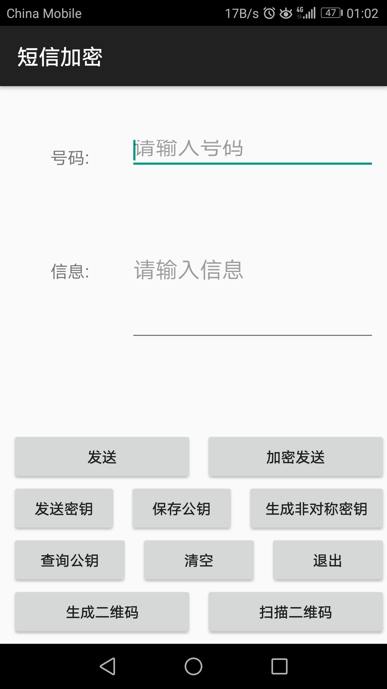

# SMS_EN
## 发送界面

## 使用

```
如果不需要加密发送
  直接输入电话号码和信息
  点击发送
否则
  如果是第一次使用软件
    生成自己的非对称密钥保存到自己数据库里面（后边的签名和对称密钥交换需要）
  如果不是第一次使用该软件
    如果需要和新人（不知道对方公钥的人）发送信息
      输入“0”，查询自己的公钥（可以生成二维码来交换）
      和对方交换公钥
      输入对方的电话号码和公钥，保存对方的公钥
    如果和已知对方公钥的好友发送信息
      如果想要变换回话密钥或者第一次与对方通话
        需要发送回话密钥给对方
      否则
        直接输入对方电话号码和信息
        点击加密发送信息
```
 
